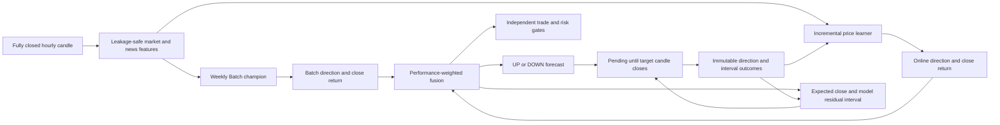

<div align="center">


<br />

<a href="https://thelouismahdi.github.io/btc-hourly-forecast/">
  
</a>

<a href="https://github.com/TheLouisMahdi/btc-hourly-forecast/actions/workflows/hourly_forecast.yml">
  
</a>

<a href="https://github.com/TheLouisMahdi/btc-hourly-forecast/actions/workflows/weekly_retrain.yml">
  
</a>

<br />
<br />


</div>

## Overview

**BTC Next-Candle Forecast** creates one immutable forecast after every fully closed hourly Bitcoin candle.

Version 3.2 makes **direction the primary forecast target**. Every forecast predicts `UP` or `DOWN` for the next hourly close. A model-estimated price interval remains available as a secondary uncertainty measure, but a wide interval can no longer make a wrong direction appear successful.

The final forecast combines:

- the weekly Batch champion;
- a dedicated incremental price learner;
- performance-weighted direction fusion;
- performance-weighted close-return fusion;
- chronological model residuals for price uncertainty.

## Forecast contract

For a source candle with open time `T`:

| Field | Time |
|---|---|
| Source candle opens | `T` |
| Source candle closes and forecast is created | `T + 1h` |
| Target candle opens | `T + 1h` |
| Target candle closes | `T + 2h` |
| Outcome becomes eligible | after `T + 2h` plus the settlement delay |

A contract contains both the direction forecast and price estimate:

```json
{
  "contract_version": 2,
  "target": "NEXT_CLOSED_1H_CANDLE",
  "direction": "UP",
  "direction_confidence": 0.61,
  "signal_strength": "MODERATE",
  "reference_close": 63250.0,
  "median_close": 63340.0,
  "likely_close_low": 63020.0,
  "likely_close_high": 63610.0,
  "forecast_source": "BATCH_AND_ONLINE",
  "target_close_time": "2026-08-03T18:00:00+00:00"
}
```

`median_close` is a model estimate, not a guaranteed price.

## Outcome rules

Direction is the primary score:

| Result | Meaning |
|---|---|
| `PENDING` | The target candle has not fully closed yet. |
| `DIRECTION_CORRECT` | The target close moved in the predicted direction. |
| `DIRECTION_WRONG` | The target close moved against the predicted direction. |
| `LEGACY_NOT_SCORED` | The record predates the current forecast contract. |

The interval is evaluated independently:

| Interval result | Meaning |
|---|---|
| `IN_RANGE` | The target close finished inside the estimated interval. |
| `OUT_OF_RANGE` | The target close finished outside the estimated interval. |

A forecast can therefore be directionally wrong while still landing inside the price interval. The dashboard reports these outcomes separately.

## Batch and Online price fusion

The price forecast is not generated from a generic current-price range.

The center of the estimate comes from trained return models:

```text
Batch next-close probability and return
                +
Incremental online probability and return
                ↓
Performance-weighted fused direction and fused return
                ↓
Expected next close
```

The online model receives weight only after enough chronological evaluation samples exist and only while it remains competitive with the Batch champion on:

- direction Brier score;
- direction accuracy;
- close-return mean absolute error.

Direction and return have independent blend weights. A model may therefore help direction without being trusted for price magnitude, or help price magnitude without changing direction.

Probability outputs are bounded to reduce extreme online overconfidence.

## Price interval calibration

The interval is centered on the fused model return. Its width is calibrated in this order:

1. residuals from resolved live forecasts;
2. chronological Walk-Forward residual quantiles;
3. Batch model return error as a final fallback.

The interval no longer uses a generic recent candle range as its primary source.

After enough live outcomes are resolved, recent prequential errors become the main calibration source so uncertainty can adapt to current market behavior.

## Architecture



## Forecast versus trade decision

The public forecast and paper-trade decision are separate contracts.

A direction forecast can be valid while the action remains `WAIT`. Trade execution still requires:

- a qualified model;
- a qualified horizon;
- a new market event;
- sufficient continuation probability;
- sufficient tradeability probability;
- positive stress-adjusted net edge;
- healthy market and news inputs;
- acceptable volatility and cooldown conditions.

This prevents a directional estimate from being presented as a guaranteed trading signal.

## Adaptive learning states

Two adaptive layers are persisted:

| State | Purpose |
|---|---|
| Trade adaptive state | Event continuation, tradeability and event-return adaptation. |
| Price adaptive state | Next-close direction and close-return adaptation. |

The dedicated price learner:

- learns from mature close-to-close labels;
- predicts before updating;
- stores prequential Batch-versus-Online observations;
- resets when the Batch champion changes;
- starts with zero decision weight;
- gains bounded weight only after passing performance checks;
- automatically returns to Batch-only output when it underperforms.

Runtime state is stored outside `main`:

| Branch | Purpose |
|---|---|
| `forecast-state` | Latest forecast and immutable outcome ledger. |
| `model-state` | Latest weekly Batch model and reports. |
| `adaptive-state` | Persistent trade and price adaptive learners. |

## Dashboard

The public site uses a calm, modern direction-first layout:

- large `UP` or `DOWN` forecast;
- direction confidence and strength;
- model-estimated expected close;
- probable close interval;
- Batch and Online influence;
- direction accuracy;
- interval coverage;
- immutable forecast ledger;
- separate trade blockers.

The footer identifies the project author as **Mahdi Ghahremani** with GitHub ID **TheLouisMahdi**.

## Automated workflows

### Hourly forecast

Every hour the pipeline:

1. restores Batch, forecast and adaptive state;
2. runs repository tests;
3. fetches fresh market and news data;
4. selects the latest fully closed hourly candle;
5. updates the dedicated online price learner from mature labels;
6. compares Batch and Online performance;
7. generates one frozen `UP` or `DOWN` forecast;
8. estimates the next close from fused model returns;
9. keeps the forecast pending until the target candle closes;
10. resolves direction and interval outcomes separately;
11. deploys the static GitHub Pages dashboard.

### Weekly retraining

The Batch model retrains weekly and whenever model, feature, configuration or forecast-contract code changes.

## Local setup

```bash
python -m venv .venv
python -m pip install --upgrade pip
python -m pip install -e .
```

Fetch data and train:

```bash
btc-regime fetch --days 180
btc-regime news --historical --days 180
btc-regime news
btc-regime train
```

Run one cycle:

```bash
btc-regime cycle --force
```

Launch the local dashboard:

```bash
btc-regime dashboard
```

Run tests:

```bash
python -m unittest discover -s tests -v
```

## Repository layout

```text
.github/workflows/           Forecast, retraining and quality workflows
config/default.yaml          Market, model, online fusion and risk configuration
docs/assets/                 Repository-owned visual assets
scripts/github_dashboard.py  Direction-first resolution and static dashboard
scripts/github_hourly_forecast.py
src/btc_ema_trader/
  adaptive.py                Trade-focused incremental learner
  price_adaptive.py          Dedicated adaptive direction and price learner
  forecast_contract.py       Immutable next-candle forecast contract
  features.py                Leakage-safe features and labels
  model.py                   Weekly Batch champion
  runtime.py                 Hourly market and decision runtime
  strategy.py                Trade and risk gates
tests/                       Forecast, adaptive and repository tests
```

## Reliability rules

- Only rows marked `closed = 1` are treated as completed candles.
- Evaluation requires the target close time and settlement delay to pass.
- Each candle receives one frozen forecast.
- Direction is always `UP` or `DOWN`; weak confidence is shown explicitly.
- Direction accuracy and interval coverage are never combined.
- Resolved outcomes are immutable.
- Online influence is performance-weighted and bounded.
- The system remains paper-trading only.

## Limitations

Bitcoin is non-stationary and noisy. Direction accuracy, interval coverage and paper-trade expectancy require a meaningful live sample before they can support commercial claims.

This repository is for transparent market-model research and is not financial advice.

---

© 2026 Mahdi Ghahremani · ID: [TheLouisMahdi](https://github.com/TheLouisMahdi)
