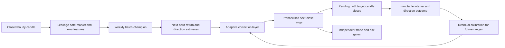

<div align="center">


<br />

<a href="https://thelouismahdi.github.io/btc-hourly-forecast/">
  
</a>

<a href="https://github.com/TheLouisMahdi/btc-hourly-forecast/actions/workflows/hourly_forecast.yml">
  
</a>

<a href="https://github.com/TheLouisMahdi/btc-hourly-forecast/actions/workflows/weekly_retrain.yml">
  
</a>

<br />
<br />


</div>

## Overview

**BTC Next-Candle Forecast** is a research system that creates one forecast after each fully closed hourly Bitcoin candle.

The public forecast is not an exact future price. It is an **80% probable close range** for the next one-hour candle, together with a median estimate, directional bias and scenario label.

The forecast is evaluated only after the target candle has fully closed. A result becomes immutable after resolution and cannot change when later candles arrive.

## Forecast contract

For a source candle with open time `T`:

| Field | Time |
|---|---|
| Source candle opens | `T` |
| Source candle closes and forecast is created | `T + 1h` |
| Target candle opens | `T + 1h` |
| Target candle closes | `T + 2h` |
| Outcome becomes eligible | after `T + 2h` plus a short settlement delay |

The forecast record includes:

```json
{
  "target": "NEXT_CLOSED_1H_CANDLE",
  "interval_probability": 0.80,
  "reference_close": 63250.0,
  "median_close": 63340.0,
  "likely_close_low": 62920.0,
  "likely_close_high": 63780.0,
  "scenario": "BULLISH_BIAS",
  "target_close_time": "2026-08-03T18:00:00+00:00"
}
```

`median_close` is an estimate, not a guaranteed price.

## Outcome rules

The primary result measures the probabilistic interval:

| Result | Meaning |
|---|---|
| `PENDING` | The target candle has not fully closed yet. |
| `IN_RANGE` | The final target close is inside the predicted range. |
| `OUT_OF_RANGE` | The final target close is outside the predicted range. |
| `LEGACY_NOT_SCORED` | The record predates the interval forecast contract. |

Direction is scored separately as `DIRECTION_CORRECT`, `DIRECTION_WRONG` or `DIRECTION_NOT_SCORED`.

A resolved result is immutable. Historical records are never reclassified from later price movement.

## How the range is produced

The interval combines:

- the batch model's next-hour return estimate;
- the model's historical out-of-sample return error;
- recent hourly market ranges;
- adaptive residuals from previously resolved live forecasts.

Before enough live residuals exist, the system uses a conservative model-error and market-range fallback. After at least 20 resolved interval forecasts, it uses empirical prequential residual quantiles and continues recalibrating from newly closed candles.

## Architecture



## Market scenarios

The forecast scenario is derived from the one-hour directional probability:

| Scenario | Interpretation |
|---|---|
| `BULLISH_BIAS` | The next close has a meaningful upward bias. |
| `BEARISH_BIAS` | The next close has a meaningful downward bias. |
| `RANGE_BIAS` | Directional evidence is weak and a range outcome is more appropriate. |

The event layer separately monitors:

- `DONCHIAN_BREAKOUT`
- `SQUEEZE_RELEASE`
- `PULLBACK_RESUME`
- `VOLUME_IMPULSE`

## Forecast versus trade decision

The public forecast and the trade decision are separate contracts.

The next-candle forecast can be valid while the trade action remains `WAIT`. Trade gates still require:

- a qualified model;
- a qualified selected horizon;
- a new market event;
- sufficient continuation probability;
- sufficient tradeability probability;
- positive stress-adjusted net edge;
- healthy market data;
- acceptable volatility, news and cooldown conditions.

This prevents a probable price range from being misrepresented as an actionable trade.

## Adaptive learning

The adaptive layer:

- restores its state on every hourly run;
- predicts before observing a matured label;
- learns only after the target candle closes;
- compares online and batch performance prequentially;
- calibrates future intervals from resolved forecast residuals;
- remains in shadow mode until its promotion criteria pass;
- falls back to the batch champion when performance degrades.

Runtime state is stored outside `main`:

| Branch | Purpose |
|---|---|
| `forecast-state` | Latest forecast and compact immutable outcome history. |
| `model-state` | Latest weekly batch model and reports. |
| `adaptive-state` | Persistent incremental learner and adaptive metrics. |

## Automated workflows

### Hourly forecast

Every hour the pipeline:

1. restores forecast, batch and adaptive state;
2. runs repository tests;
3. fetches fresh market and news data;
4. selects the latest fully closed hourly candle;
5. creates one next-candle probabilistic forecast;
6. keeps unresolved forecasts pending;
7. resolves only targets whose candles have fully closed;
8. freezes resolved outcomes;
9. recalibrates future ranges from resolved residuals;
10. deploys the static GitHub Pages dashboard.

### Weekly retraining

The batch model retrains weekly and whenever the forecast contract, model configuration or training code changes.

## Local setup

```bash
python -m venv .venv
python -m pip install --upgrade pip
python -m pip install -e .
```

Fetch data and train:

```bash
btc-regime fetch --days 180
btc-regime news --historical --days 180
btc-regime news
btc-regime train
```

Run one cycle:

```bash
btc-regime cycle --force
```

Launch the local dashboard:

```bash
btc-regime dashboard
```

Run tests:

```bash
python -m unittest discover -s tests -v
```

## Repository layout

```text
.github/workflows/           Forecast, retraining and quality workflows
config/default.yaml          Market, forecast, model and risk configuration
docs/assets/                 Repository-owned visual assets
scripts/github_dashboard.py  Immutable close-time outcome resolution
scripts/github_hourly_forecast.py
src/btc_ema_trader/
  adaptive.py                Persistent incremental learner
  forecast_contract.py       Next-candle probabilistic interval contract
  features.py                Leakage-safe features and labels
  model.py                   Weekly batch champion
  runtime.py                 Hourly market and decision runtime
  strategy.py                Trade and risk gates
tests/                       Contract, adaptive and repository tests
```

## Reliability rules

- Only database rows marked `closed = 1` are used as completed candles.
- Evaluation also requires the target close time to have passed.
- A 90-second settlement delay protects against provider timing differences.
- Legacy direction-only forecasts are excluded from interval accuracy.
- Resolved outcomes are immutable.
- The median estimate is never presented as an exact future price.
- The system remains paper-trading only.

## Limitations

Bitcoin is non-stationary and highly noisy. An 80% interval is a calibrated probability target, not a promise that exactly 80% of every small sample will fall inside the range. Coverage must be assessed over a meaningful number of resolved forecasts.

This repository is for transparent market-model research and is not financial advice.
