 

  

  

# BTC Adaptive Directional Breakout Trader

### Structural intelligence. Adaptive risk. Verifiable outcomes.

An always-on Bitcoin market intelligence platform that converts confirmed market-structure events into auditable paper positions and continuously evaluated one-hour forecasts.

## Market Intelligence, Delivered Hourly

BTC Adaptive Directional Breakout Trader is a research-grade decision platform built to identify meaningful resistance breakouts and support breakdowns while filtering weak, duplicated, stale, or operationally unsafe signals.

The system combines structural market analysis, separate Long and Short predictive models, adaptive target-and-stop planning, execution-aware risk controls, and continuous outcome tracking in one automated research environment.

Its primary product is a persistent paper position with a frozen entry reference, target, stop-loss, risk allocation, holding window, and immutable final outcome. A secondary public forecast tracks the direction and likely closing range of the next completed one-hour candle.

## Live Research Snapshot

  

The live indicators above are sourced from the latest public forecast snapshot and refresh automatically. The dashboard provides the complete market context, active-position lifecycle, forecast history, resolved outcomes, model status, and risk information.

**Public live records:** [Latest forecast](https://github.com/TheLouisMahdi/btc-hourly-forecast/blob/forecast-state/latest.json) · [Forecast history](https://github.com/TheLouisMahdi/btc-hourly-forecast/blob/forecast-state/history.json) · [Paper-position ledger](https://github.com/TheLouisMahdi/btc-hourly-forecast/blob/forecast-state/trades.json) · [Model metrics](https://github.com/TheLouisMahdi/btc-hourly-forecast/blob/model-state/latest_metrics.csv)

## Product Capabilities

| Capability | Business value |
|---|---|
| **Structural Signal Engine** | Detects confirmed resistance breakouts and support breakdowns across multiple market scales instead of reacting to isolated indicator crosses. |
| **Independent Long and Short Intelligence** | Models upside and downside events separately, allowing each direction to learn its own market behavior and risk profile. |
| **Adaptive Position Lifecycle** | Maintains one auditable paper position from entry through target, stop-loss, breakeven, trailing management, or time exit. |
| **Risk-Scaled Decisioning** | Adjusts paper risk according to event quality, confidence, tradeability, economic edge, volatility, data health, and negative-pattern evidence. |
| **Continuous Evaluation** | Scores forecasts only after the exact target candle closes and preserves completed outcomes without retroactive rewriting. |
| **Auditable Research Operations** | Provides explicit manual workflows for quality validation, hourly cycles, dashboard deployment and policy-driven challenger training. |

## Maintenance mode

GitHub Actions workflows are currently manual-only. This prevents overlapping scheduled runs while repository structure and data resilience are validated. The supported execution order is documented in [Repository structure](docs/REPOSITORY_STRUCTURE.md).

## Built for Trust, Not Hype

The platform is designed around causal inputs and auditable decisions. Future candles are never used as predictors, historical validation remains chronological, synthetic event duplication is prohibited, and model challengers cannot replace the active champion unless they pass locked economic and negative-memory validation gates.

Operational safeguards can prevent a new position when market data is incomplete, the execution quote is stale, providers are inconsistent, the event has already been traded, or another position is still active.

Every published position and forecast remains attributable to the model, event, market timestamp, data provider, execution assumptions, and risk contract that created it.

## Verifiable Product Contracts

The commercial surface is backed by explicit machine-tested contracts rather than marketing-only claims:

- Structural opportunities are classified as `RESISTANCE_BREAKOUT_LONG` or `SUPPORT_BREAKDOWN_SHORT`.
- Directional model inventory requires at least `2,000 unique` events per side with `sampling: NONE`.
- Published champion identifiers follow the `directional-breakout-hourly-` model family.
- The secondary public product is bound to the exact `NEXT_CLOSED_1H_CANDLE`.
- Completed direction outcomes are immutable as `DIRECTION_CORRECT` or `DIRECTION_WRONG`; interval outcomes remain independently immutable as `IN_RANGE` or `OUT_OF_RANGE`.

## Commercial Direction

This project is being developed as a foundation for real-time Bitcoin market intelligence, quantitative research dashboards, signal-quality analysis, auditable paper-trading operations, and future decision-support products.

The platform is intentionally transparent about uncertainty. It does not present backtests as guaranteed performance, does not place live orders, and does not claim profitability. Its commercial value is built around disciplined research infrastructure, explainable market context, continuous measurement, and verifiable public outcomes.

## Current Product Scope

| Area | Current scope |
|---|---|
| Market | Bitcoin spot and compatible BTC market data |
| Decision cadence | Closed one-hour candles |
| Primary output | Long, Short, Hold, or Wait paper-position lifecycle |
| Secondary output | Exact next closed one-hour candle direction and likely close range |
| Execution mode | Paper trading only |
| Public transparency | Live dashboard, forecast history, position ledger, and model metrics |

## Research Notice

This repository is an experimental quantitative-research system. Forecasts, probabilities, target prices, stop prices, expected values, and dashboard outputs are research estimates rather than financial advice or guarantees of future performance.

## Proprietary Rights

Copyright © 2026 **TheLouisMahdi**. All rights reserved.

This repository is proprietary and is not open-source software. Reuse, copying, modification, redistribution, commercial or non-commercial deployment, derivative work, dataset creation, or model training requires prior written permission and clear attribution under the terms of the repository [LICENSE](LICENSE).
