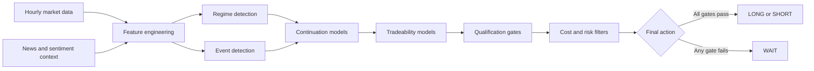

<div align="center">


<br />

<a href="https://thelouismahdi.github.io/btc-hourly-forecast/">
  
</a>

<a href="https://github.com/TheLouisMahdi/btc-hourly-forecast/actions/workflows/hourly_forecast.yml">
  
</a>

<br />
<br />


</div>

---

## Overview

**BTC Hourly Forecast** is a research-oriented Bitcoin market analysis system built around one-hour candles, market-regime detection, event-based machine learning and conservative trade qualification.

Instead of relying on a single moving-average crossover, the system detects independent market events, estimates whether an event is likely to continue, evaluates whether the expected move remains tradeable after costs, and applies a layered fail-safe policy before producing a paper-trade action.

The project runs automatically with **GitHub Actions** and publishes a compact static dashboard through **GitHub Pages**. A local Gradio dashboard is also included for development and deeper inspection.

> The system may forecast a direction while still returning `WAIT`. This is intentional: a directional prediction is not treated as a valid trade unless every qualification and risk gate passes.

---

## Core capabilities

| Capability | Description |
|---|---|
| Hourly market pipeline | Processes `BTCUSDT` one-hour candles with a 180-day rolling history. |
| Multiple data providers | Supports Binance Futures, Bybit Linear and OKX Swap with fallback ordering. |
| Event-driven features | Detects breakout, squeeze-release, pullback-resume and volume-impulse events. |
| Regime awareness | Uses KAMA, ADX, volatility and directional features to describe market conditions. |
| News context | Aggregates recent RSS and GDELT data with time-aware availability controls. |
| Multi-horizon models | Evaluates event continuation and tradeability across 1, 2 and 3-hour horizons. |
| Walk-forward evaluation | Uses time-ordered validation with a gap between training and evaluation windows. |
| Cost-aware decisions | Includes maker/taker fees, slippage, stress costs and minimum edge requirements. |
| Fail-safe execution | Blocks signals when model quality, freshness, risk or agreement requirements fail. |
| Automated publishing | Generates a new static dashboard on GitHub Pages every hour. |

---

## Market events

The decision engine focuses on four event families:

| Event | Interpretation |
|---|---|
| `DONCHIAN_BREAKOUT` | Price breaks beyond a recent Donchian channel boundary. |
| `SQUEEZE_RELEASE` | Volatility expands after a compressed Bollinger-band regime. |
| `PULLBACK_RESUME` | Price returns toward KAMA and attempts to resume the prevailing direction. |
| `VOLUME_IMPULSE` | A directional candle appears with an abnormal increase in volume. |

KAMA and ADX are used primarily for regime context rather than as direct crossover signals.

---

## Decision pipeline



The model layer produces probabilities. The strategy layer decides whether those probabilities are sufficiently reliable and economically meaningful after estimated trading costs.

---

## Automated operation

### Hourly forecast

The hourly workflow runs at minute `17` of every UTC hour:

```text
.github/workflows/hourly_forecast.yml
```

It restores the latest model and compact prediction history, downloads current inputs, creates one forecast, rebuilds the static dashboard and deploys it to GitHub Pages.

### Weekly retraining

The retraining workflow runs every Sunday at `03:47 UTC`:

```text
.github/workflows/weekly_retrain.yml
```

It downloads a fresh 180-day training window, evaluates the model with time-ordered splits and publishes the latest accepted model snapshot for subsequent hourly runs.

Model state and forecast history are stored on dedicated snapshot branches so the main branch remains clean and the repository history does not grow with a committed SQLite database every hour.

---

## Fail-safe philosophy

A model is not considered trade-ready merely because it can output `UP` or `DOWN`.

The strategy can block a signal for reasons including:

- no fresh qualifying market event;
- insufficient event or tradeability probability;
- failed out-of-sample qualification;
- weak agreement between forecast horizons;
- non-positive expected return after costs;
- excessive volatility or stale market data;
- news-shock restrictions;
- cooldown or daily signal limits.

This conservative design makes `WAIT` a normal and expected result rather than an error.

---

## Quick start

### Requirements

```text
Python 3.11+
Windows or Linux
Internet access for market and news sources
```

### Clone and install

```bash
git clone https://github.com/TheLouisMahdi/btc-hourly-forecast.git
cd btc-hourly-forecast
python -m venv .venv
```

Activate the environment:

```bash
# Windows PowerShell
.\.venv\Scripts\Activate.ps1

# Linux / macOS
source .venv/bin/activate
```

Install the project:

```bash
python -m pip install --upgrade pip
python -m pip install -e .
```

### Windows launchers

```text
start_first_run.bat     Initial data collection, training and launch
start_live.bat          Live engine and local dashboard
start_retrain.bat       Manual model retraining
start_status.bat        Current runtime status
```

The default local dashboard address is:

```text
http://127.0.0.1:7860
```

---

## Repository structure

```text
.github/workflows/    Scheduled forecast and retraining automation
artifacts/            Model snapshots and evaluation reports
config/               Market, model, strategy and runtime settings
data/                 Local database and runtime state
docs/                 Architecture, evaluation and fail-safe documentation
scripts/              GitHub automation and deployment helpers
src/btc_ema_trader/   Core Python package
tests/                Feature, model, runtime and strategy tests
```

---

## Important outputs

```text
artifacts/models/latest.joblib
artifacts/reports/latest_training_report.json
artifacts/reports/latest_metrics.csv
data/runtime_state.json
data/btc_ema_hourly.sqlite3
```

The scheduled GitHub deployment additionally publishes compact `latest.json` and `history.json` snapshots for the static dashboard.

---

## Research and risk notice

This repository is an experimental forecasting and **paper-trading** project.

- It does not place real orders.
- It does not guarantee predictive accuracy or profitability.
- Historical and walk-forward results do not guarantee future performance.
- Market-data, news and exchange APIs may be delayed, unavailable or incomplete.
- Trading costs, liquidity and slippage can materially change real outcomes.

The default configuration keeps `paper_only: true`, and that setting should remain enabled unless the system has been independently reviewed, validated and adapted for a clearly defined real-world risk framework.

---

## Author

<div align="center">

### Developed by **LouisMahdi**

Built as an applied machine-learning and market-systems research project focused on transparent evaluation, conservative decision gates and automated reproducibility.

<a href="https://github.com/TheLouisMahdi">
  
</a>

<br />
<br />


</div>
