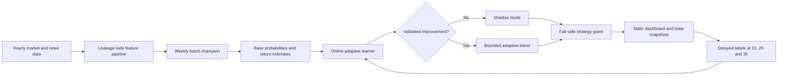

<div align="center">


<a href="https://thelouismahdi.github.io/btc-hourly-forecast/">
  
</a>

<a href="https://github.com/TheLouisMahdi/btc-hourly-forecast/actions/workflows/hourly_forecast.yml">
  
</a>

<br />
<br />


</div>

---

## Overview

**BTC Hourly Forecast** is a research-oriented Bitcoin market analysis system for one-hour candles. It combines a weekly batch model with a persistent adaptive correction layer that learns from every newly matured label.

The batch model detects market regimes and independent events. The adaptive layer receives delayed labels after each forecast horizon closes, evaluates itself prequentially, updates incrementally, and earns permission to influence decisions only when it outperforms the batch champion under strict safety criteria.

A directional forecast does not automatically become a trade. Qualification, event, liquidity, expected-edge, execution-cost and risk gates can still return `WAIT`.

---

## Adaptive architecture



### Batch champion

- Uses a 180-day rolling market and news window.
- Trains separate models for 1-hour, 2-hour and 3-hour horizons.
- Uses chronological walk-forward evaluation with a validation gap.
- Produces general direction, event continuation, tradeability and return estimates.
- Retrains weekly and remains the fallback decision source.

### Adaptive learner

- Uses `SGDClassifier`, `SGDRegressor` and incremental scaling.
- Learns only after labels mature, preventing future leakage.
- Updates on every newly resolved row.
- Tracks base-versus-online Brier score, accuracy and return error.
- Starts in `SHADOW` mode.
- Activates per horizon only after minimum sample counts and measurable improvement.
- Uses a bounded blend instead of replacing the batch model.
- Suspends automatically when recent online performance degrades.
- Persists between GitHub Actions runs in the `adaptive-state` branch.

---

## Market logic

The event layer is independent of the former EMA crossover design. It detects:

| Event | Description |
|---|---|
| `DONCHIAN_BREAKOUT` | Price breaks a recent channel with volume confirmation. |
| `SQUEEZE_RELEASE` | Volatility compression releases outside the Bollinger envelope. |
| `PULLBACK_RESUME` | A trend resumes after a controlled pullback toward KAMA. |
| `VOLUME_IMPULSE` | A directional candle expands with abnormal volume. |

The model estimates whether the event continues, whether the move remains tradeable after costs, and whether the expected edge survives stress assumptions.

---

## Delayed-label contract

Each forecast is evaluated using the same timing convention as training:

1. The source is a closed hourly candle.
2. Entry is the open of the next hourly candle.
3. Evaluation occurs at the close of the selected 1-hour, 2-hour or 3-hour horizon.
4. Outcomes are recorded as `CORRECT`, `WRONG`, `PENDING` or `NOT_SCORED`.

The dashboard reports resolved accuracy, actual return, adaptive status and per-horizon base-versus-online metrics.

---

## Safety model

The system remains paper-trading only. An actionable signal requires all relevant gates to pass, including:

- batch model qualification;
- selected-horizon qualification;
- a new independent market event;
- continuation confidence;
- tradeability probability;
- horizon agreement;
- positive stress-adjusted edge;
- healthy market data;
- volatility, news-shock, cooldown and daily-signal limits.

Adaptive activation does not bypass these controls.

---

## Automated workflows

### Hourly pipeline

The hourly workflow:

1. restores forecast, batch-model and adaptive state;
2. runs repository quality tests;
3. refreshes 180 days of hourly market data;
4. resolves newly matured labels;
5. updates the adaptive learner incrementally;
6. produces a forecast;
7. renders the static dashboard;
8. persists forecast and adaptive state;
9. deploys GitHub Pages.

### Weekly retraining

The weekly workflow fetches fresh market and news history, retrains the batch champion, publishes the new model snapshot and triggers a fresh hourly evaluation.

---

## Local setup

```bash
python -m venv .venv
```

Activate the environment and install the project:

```bash
python -m pip install --upgrade pip
python -m pip install -e .
```

Fetch data and train the batch model:

```bash
btc-regime fetch --days 180
btc-regime news-refresh --historical --days 180
btc-regime train
```

Run one adaptive cycle:

```bash
btc-regime live --once --force
```

Start the local dashboard:

```bash
btc-regime dashboard
```

Run the repository tests:

```bash
python -m unittest discover -s tests -v
```

---

## Repository layout

```text
.github/workflows/       Scheduled forecasting and retraining
config/                  Market, model, adaptive and risk configuration
scripts/                 GitHub automation and dashboard rendering
src/btc_ema_trader/      Core package
  adaptive.py            Incremental adaptive learner
  features.py            Leakage-safe features and delayed labels
  model.py               Weekly batch champion
  runtime.py             Integrated hourly execution pipeline
  strategy.py            Qualification and fail-safe decisions
tests/                   Adaptive, dashboard and repository quality tests
```

---

## State branches

Runtime state is isolated from the source branch:

| Branch | Purpose |
|---|---|
| `forecast-state` | Latest forecast and compact forecast history. |
| `model-state` | Latest weekly batch model and training reports. |
| `adaptive-state` | Incremental learner artifact and adaptive metrics. |

These branches are managed by GitHub Actions and are force-updated snapshots.

---

## Limitations

- Bitcoin markets are non-stationary and noisy.
- Online improvement is not guaranteed.
- A higher directional accuracy does not guarantee positive trading expectancy.
- The adaptive layer can remain in shadow mode indefinitely if it does not demonstrate a reliable advantage.
- Historical, live and adaptive metrics are research diagnostics, not financial advice.

---

<div align="center">

Built for transparent, reproducible and conservative market-model research.

</div>
