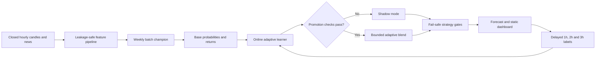

<div align="center">


<br />

<a href="https://thelouismahdi.github.io/btc-hourly-forecast/">
  
</a>

<a href="https://github.com/TheLouisMahdi/btc-hourly-forecast/actions/workflows/hourly_forecast.yml">
  
</a>

<a href="https://github.com/TheLouisMahdi/btc-hourly-forecast/actions/workflows/weekly_retrain.yml">
  
</a>

<br />
<br />


</div>

## Overview

**BTC Hourly Forecast** is a research-oriented Bitcoin market analysis system for closed one-hour candles. It combines a weekly batch champion with a persistent adaptive correction layer that learns from newly matured labels.

The system produces directional forecasts for 1-hour, 2-hour and 3-hour horizons, evaluates market events, estimates tradeability after execution costs and publishes a mobile-friendly static dashboard through GitHub Pages.

A forecast does not automatically become a trade. Qualification, event, expected-edge, data-health and risk gates can return `WAIT` even when the directional prediction is confident.

## Core capabilities

| Area | Implementation |
|---|---|
| Market data | BTC perpetual hourly candles with provider fallback |
| News data | Recent and historical crypto news features |
| Batch model | Weekly walk-forward training on a rolling 180-day window |
| Adaptive model | Incremental delayed-label learning with persisted state |
| Horizons | Independent 1h, 2h and 3h outputs |
| Event layer | Donchian breakout, squeeze release, pullback resume and volume impulse |
| Safety | Qualification, cost, event, volatility, cooldown and data-health gates |
| Delivery | Hourly GitHub Actions pipeline and static GitHub Pages dashboard |

## Adaptive architecture



### Batch champion

- Uses a rolling 180-day market and news window.
- Trains separate models for 1-hour, 2-hour and 3-hour horizons.
- Uses chronological walk-forward evaluation with a validation gap.
- Predicts direction, event continuation, tradeability and event-aligned return.
- Retrains weekly and remains the fallback decision source.

### Adaptive learner

- Uses incremental classifiers and regressors.
- Predicts before observing each matured label.
- Updates only after the relevant horizon has closed.
- Tracks batch-versus-online Brier score, accuracy and return error.
- Starts in `SHADOW` mode and activates per horizon only after configured promotion checks.
- Uses a bounded blend instead of replacing the batch model.
- Suspends automatically when recent performance degrades.
- Persists between workflow runs in the `adaptive-state` branch.

## Market events

| Event | Description |
|---|---|
| `DONCHIAN_BREAKOUT` | Price breaks a recent channel with volume confirmation. |
| `SQUEEZE_RELEASE` | Volatility compression releases outside the Bollinger envelope. |
| `PULLBACK_RESUME` | A trend resumes after a controlled pullback toward KAMA. |
| `VOLUME_IMPULSE` | A directional candle expands with abnormal volume. |

The event model estimates whether the move continues, whether it remains tradeable after costs and whether the expected edge survives stress assumptions.

## Decision gates

Common `WAIT` reasons are intentional safety controls:

| Gate | Meaning |
|---|---|
| `MODEL_NOT_QUALIFIED` | No model horizon has passed the required validation criteria. |
| `SELECTED_HORIZON_NOT_QUALIFIED` | The currently selected horizon is not approved for trading decisions. |
| `NO_NEW_MARKET_EVENT` | No fresh independent market event exists on the latest closed candle. |
| `INSUFFICIENT_STRESS_NET_EDGE` | Expected return does not exceed stress-adjusted costs and the required profit buffer. |

These gates are not errors. They prevent weak forecasts from becoming paper-trade actions.

## Delayed-label contract

Forecast outcomes use the same timing convention as training:

1. The source is a closed hourly candle.
2. Entry is the open of the next hourly candle.
3. Evaluation occurs at the close of the selected horizon.
4. Results are recorded as `CORRECT`, `WRONG`, `PENDING` or `NOT_SCORED`.

## Automation

### Hourly forecast

The hourly workflow:

1. restores forecast, batch-model and adaptive state;
2. runs repository quality tests;
3. refreshes market and recent news data;
4. resolves newly matured labels;
5. updates the adaptive learner;
6. produces the next forecast;
7. renders the static dashboard;
8. persists state snapshots;
9. deploys GitHub Pages.

### Weekly retraining

The weekly workflow refreshes the 180-day market and news window, retrains the batch champion, publishes the model snapshot and triggers a fresh hourly evaluation.

## Quick start

Create and activate a Python 3.11 environment, then install the project:

```bash
python -m venv .venv
python -m pip install --upgrade pip
python -m pip install -e .
```

Fetch data, collect news and train the first batch model:

```bash
btc-regime bootstrap --days 180 --provider auto
```

Run one diagnostic cycle:

```bash
btc-regime cycle --force
```

Start the local dashboard and runtime engine:

```bash
btc-regime dashboard
```

Run the complete test suite:

```bash
python -m unittest discover -s tests -v
```

## Repository layout

```text
.github/workflows/       Forecasting, retraining and quality automation
config/                  Market, model, adaptive and risk configuration
docs/assets/             Repository-owned visual assets
scripts/                 GitHub automation and static dashboard rendering
src/btc_ema_trader/      Core Python package
tests/                   Adaptive, outcome and repository-quality tests
```

## State branches

Runtime artifacts are isolated from source code:

| Branch | Purpose |
|---|---|
| `forecast-state` | Latest forecast and compact forecast history |
| `model-state` | Latest weekly batch model and training reports |
| `adaptive-state` | Incremental learner artifact and adaptive metrics |

The state branches are managed by GitHub Actions as force-updated snapshots.

## Reliability and scope

- The project is paper-trading only.
- Bitcoin markets are noisy and non-stationary.
- Online improvement is not guaranteed.
- Higher directional accuracy does not guarantee positive trading expectancy.
- The adaptive layer may remain in shadow mode if it does not demonstrate a reliable advantage.
- Serialized model files must be treated as trusted artifacts and must not be loaded from unknown sources.
- Historical and live outputs are research diagnostics, not financial advice.

## Project standards

- All code, comments, documentation and user-facing repository text must be written in English.
- Changes must preserve chronological evaluation and delayed-label integrity.
- Repository tests must pass before deployment.
- Contribution guidance is available in [CONTRIBUTING.md](CONTRIBUTING.md).
- Security reporting guidance is available in [SECURITY.md](SECURITY.md).

<div align="center">

Built for transparent, reproducible and conservative market-model research.

</div>
